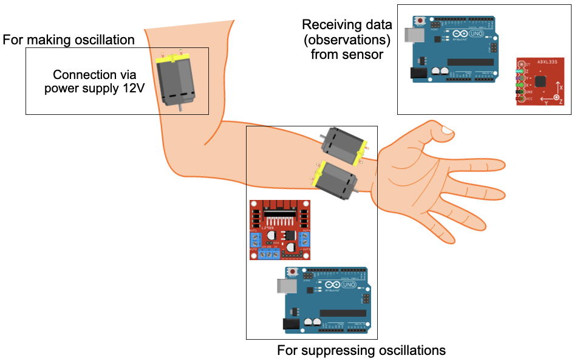

# RL-TREMOR-SUPPRESSION
System-software phantom for tremor suppression by using reinforcement learning

The code contains the environments for the reinforcement learning model. The first environment works with a physical model. The second environment works with a virtual model written on the base of the [OpenSim](https://opensim.stanford.edu).

## Physical Part

### Requirements

* Python 3.7
* [OpenAI Gym](https://github.com/openai/gym) - open-source library for making gyms
* [pySerial](https://github.com/pyserial/pyserial) - library for communication between Arduino and Python
* [Stable Baselines](https://github.com/hill-a/stable-baselines) - library with implemented reinforcement learning algorithms

In order to use the environment, you should have 

* Arduino Uno x2
* Sensor GY-61
* DC-motor x3 (connecting via L298N)

<p align="center">


</p>
<p align="center">
<em>Sample caption</em>
</p>


## Virtual Part

### Requirements

* Python 3.7
* [OpenAI Gym](https://github.com/openai/gym) - open-source library for making gyms
* [OpenSim 4.2](https://github.com/opensim-org/opensim-core) - software for developing models of musculoskeletal structures 
* [Stable Baselines](https://github.com/hill-a/stable-baselines) - library with implemented reinforcement learning algorithms


# Citing

If you use this package in your publications or in other work, please cite it as follows:

```
@misc{rl_tremor_sup,
    title={System-software phantom for tremor suppression by using reinforcement learning},
    author={Anna Anikina},
    year={2018},
    publisher = {GitHub},
    journal = {GitHub repository},
    howpublished = {\url{https://github.com/cviaai/RL-TREMOR-SUPPRESSION/}}

}
```
